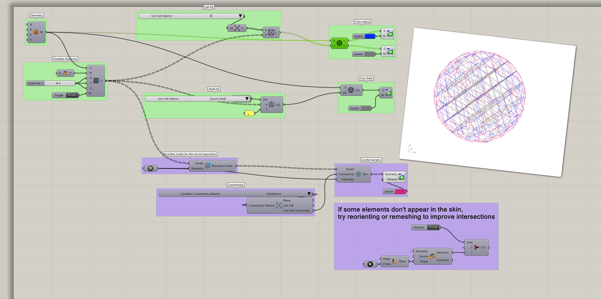

This feature release (v2.1.0) brings some new features and unreleased components from the legacy GitHub page. 

## What's new

### Legacy features

> Contributed by [@fequalsf](https://github.com/fequalsf)

These components were previously available as a reward for anyone who downloaded Crystallon from the previous GitHub page. Now they're included in the package manager download too!

Check out `Bezier Curve`, `Curve Graph`, and `Curve Plotter` in the **Utilities** tab, and find `Divide Surface` in the **Voxelize** tab.

### Beta

With this release of Crystallon, we're introducing a **Beta** tab for components in testing. There you'll find any components that we're releasing for everyone to experiment with and provide feedback on. Our goal is to polish these components over the course of the release cycle and integrate them into the core library by the next minor release. 

#### Conformal skin

> Contributed by [@woodwirk](https://github.com/woodwirk)  
> [@slicelab](https://github.com/slicelab): Tetrahedral and NaCl cells

The main feature in beta for v2.1 is the set of components for creating a conformal lattice skin. Support those hanging trimmed beams with a conformal net skin that reflects the intrinsic geometry of the unit cell at the boundary of your mesh or Brep input. The methods are based on the paper _Scalable, process-oriented beam lattices: Generation, characterization, and compensation for open cellular structures_, and you can read more here: https://doi.org/10.1016/j.addma.2021.102386. We're excited to what you do with it!

[Download the example file.](/Crystallon/docs/examples/v2.1.0/v2.1.0-Conformal_Skin.gh)

- Connectivity Selector
- Connectivity Type
- Boundary Voxels
- Conformal Skin

